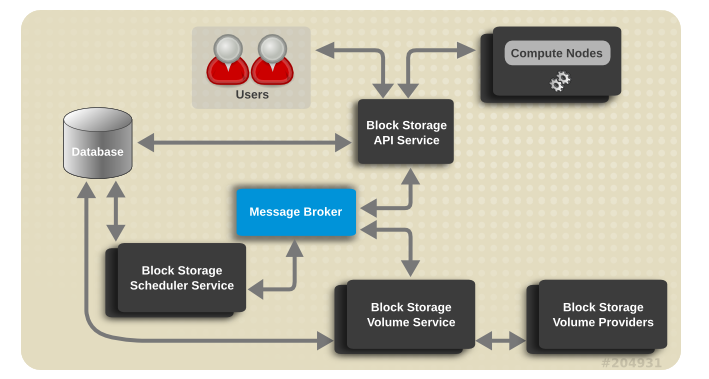

## Tổng quản về Cinder

## Mục lục

### [1. Giới thiệu về cinder](#gioithieu) 
### [1.1 Khái niệm](#khainiem) 
### [1.2 Các chức năng](#chucnang) 
### [2. Kiến trúc của Cinder](#kientruc) 
### [2.1 Kiến trúc của Cinder](kientruc1) 
### [2.2 Các thành phần](#thanhphan) 
### [3. Các phương thức tạo máy ảo trên hệ quy chiếu cinder](#phuongthuc) 
<a name="gioithieu"</a>
## 1. Giới thiệu về cinder

### 1.1 Khái niệm:

- Cinder là dịch vụ Block Storage trong Openstack. Nó được thiết kế để người dùng cuối có thể thực hiện việc lưu trữ bởi Nova, việc này được thực hiện bởi LVM hoặc các plugin driver cho các nền tảng lưu trữ khác
- Cinder ảo hóa việc quản lý các thiết bị block storage và cung cấp cho người dùng cuối một API đáp ứng được nhu cầu tự phục vụ cũng như tiêu thụ các tài nguyên đó mà không cần biết quá nhiều kiến thức chuyên sâu

### 1.2 Các chức năng

- Cung cấp và quản lý các tài nguyên lưu trữ dạng persistent block storage (volume) cho các máy ảo
- Các volume này có thể được tách từ máy ảo này và gán lại vào một máy ảo khác, mà dữ liệu được giữ nguyên không bị thay đổi
- Một volume chỉ có thể được gán (attached) và một máy ảo tại một thời điểm 
- Các volume tồn tại độc lập với các máy ảo (tức là khi máy ảo bị xóa thì volume không bị xóa)
- Phân chia tài nguyên lưu trữ thành các khối gọi là Cinder volume
- Cung cấp các API như là tạo, xóa, backup, restore, tạo snapshot, clone volume ... Những API này thực hiện bởi các backend lưu trữ mà được cinder hỗ trợ

## 2. Kiến trúc của Cinder

### 2.1 Kiến trúc của Cinder

- Cinder-api : trả lời và xử lý theo yêu cầu, gửi các tin nhắn vào hàng chờ . Khi có một request gửi đến, các API nhờ indentify service để xác thực , sau đó gửi thông điệp để làm việc với các block storage
- Cinder-scheduler : Lên lịch và định tuyến các yêu cầu tới dịch vụ volume thích hợp. Tùy thuộc vào cách cấu hình, có thể chỉ là dùng round-robin để định ra việc sẽ dùng volume service nào, hoặc có thể phức tạp hơn bằng cách dùng Filter Scheduler. Filter Scheduler là mặc định và bật các bộ lọc như Capacity, Avaibility Zone, Volume Type, và Capability
- Cinder-volume : quản lý vòng đời volume cho các máy ảo theo yêu cầu . Khi có một request từ sheduler , volume service sẽ tạo, chỉnh sửa, xóa các volume theo yêu cầu. Một số các driver sẽ được sử dụng để làm việc với storage provider
- Cinder-backup : Cung cấp phương thức để backup một Block Storage volume tới Openstack Object Storage (Swift)
- Driver : Chứa các mã back-end cụ thể để có thể liên lạc với các loại lưu trữ khác nhau
- RabbitMQ server : cung cấp hàng chờ tin nhắn AMQP, RabbitMQ làm việc với các các Openstack Copoment khác : hàng chờ, phân phối,, quản lý, bảo mật liên kết
- Database : lưu thạng trái các volume

### 2.2 Các thành phần:

- Back-end Storage Device : Dịch vụ Block Storage yêu cầu một vài kiểu của back-end storage mà dịch vụ có thể chạy trên đó. Mặc định là sử dụng LVM trên một local volume group tên là "cinder-volumes"
- User và Project : Cinder được dùng bởi các người dùng hoặc khách hàng khác nhau (project trong một shared system), sử dụng chỉ định truy cập dưa vào role (role-based access). Các role kiểm soát các hành động mà người dùng được phép thực hiện. Trong cấu hình mặc định, phần lớn các hành động không yêu cầu một role cụ thể, nhưng sysad có thể cấu hình trong file policy.json để quản lý các rule. Một truy cập của người dùng có thể bị hạn chế bởi project, nhưng username và pass được gán chỉ định cho mỗi user. Key pairs cho phép truy cập tới một volume được mở cho mỗi user, nhưng hạn ngạch để kiểm soát sự tiêu thu tài nguyên trên các tài nguyên phần cứng có sẵn là cho mỗi project
- Volume, Snapshot và Backup
  - Volume : Các tài nguyên block storage được phân phối có thể gán vào máy ảo như một ổ lưu trữ thứ 2 hoặc có thể dùng như là vùng lưu trữ cho root để boot máy ảo. Volume là các thiết bị block storage R/W bền vững thường được dùng để gán vào compute node thông qua iSCSI
  - Snapshot : Một bản copy trong một thời điểm nhất định của một volume. Snapshot có thể được tạo từ một volume mà mới được dùng gần đây trong trạng thái sẵn sàng. Snapshot có thể được dùng để tạo một volume mới thông qua việc tạo từ snapshot
  - Backup : Một bản copy lưu trữ của một volume thông thường được lưu ở Swift
  

## 3. Các phương thức tạo máy ảo trên hệ quy chiếu cinder

- Image : Tạo một ephameral disk từ image đã chọn
- Volume : Boot máy ảo từ một bootable volume đã có sẵn
- Volume snapshot (tạo một volume mới) : Tạo một volume từ volume snapshot đã chọn và boot máy ảo từ đó
- Instance snapshot: Tạo một bootable volume mới từ image đã chọn và boot máy ảo từ đó
