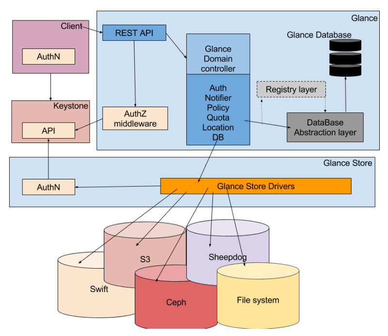

## Tổng quan về Openstack Image Service - Glance

## Mục Lục

### [1. Giới thiệu về Glance](#gioithieu)
### [2. Các thành phần của Glance](#cacthanhphan)
### [3. Kiến trúc của Glance](#kientruc)
### [4. Các file cấu hình của Glance](#filecauhinh)
### [5. Các dịnh dạng Image của Glance](#cacdinhdang)

=============================================================================

## 1. Giới thiệu về Glance
- Image service cho phép user khám phá, đăng ký và truy xuất tới image của máy ảo.Nó chấp nhận các request về Disk image và metadata image máy ảo từ phía người dùng
- Image service hỗ trợ lưu trữ dưới dạng file hệ thống đơn giản tới hệ thống object-storage như OpenStack Object Storage
- Trong Glance, các images được lưu trữ giống như các template. Các Template này sử dụng để vận hành máy ảo mới. Glance là giải pháp để quản lý các ảnh đĩa trên cloud. Nó cũng có thể lấy bản snapshots từ các máy ảo đang chạy để thực hiện dự phòng cho các VM và trạng thái các máy ảo đó

## 2. Các thành phần của Glance
- Glance có một số thành phần như sau
  - glance-api : Tiếp nhận yêu cầu gọi API về tìm kiếm, thu thập và lưu trữ image
  - glance-registry : Tiếp nhận lưu trữ, thu thập và xư lý metadata của image.Metadata bao gồm thông tin về dung lượng và loại của image
  - Database : Lưu trữ metadata của image
  - Storage repository for image files: Có rất nhiều các loại repository được hỗ trợ để lưu image như Object Storage, RADOS block devices, VMware datastore và HTTP
  - Metadata definition service : Một API phổ biến cho các nhà cung cấp, quản trị viên, dịch vụ và người dùng để xác định một metadata của riêng họ

  
## 3. Kiến trúc của Glance
- Glance có kiến trúc client-server và cung cấp REST API thông qua đó yêu cầu tới server được thực hiện.
- Yêu cầu từ client được tiếp nhận thông qua REST API và đợi sự xác thực của Keystone. Keystone Domain controller quản lý tất cả các tác vụ vận hành bên trong. Các tác vụ này chia thành các lớp, mỗi lớp triển khai nhiệm vụ vụ riêng của chúng.
- Glance store driver là lớp giao tiếp giữa glane và các hệ thống backend bên ngoài hoặc hệ thống tệp tin cục bộ, cung cấp giao diện chung để truy cập. Glance sử dụng SQL Database làm điểm truy cập cho các thành phần khác trong hệ thống.

- Glance tiếp nhận các API request yêu cầu images từ người dùng cuối hoặc các nova component và có thể ưu trữ các file images trong hệ thống object storage Swift hoặc các storage repos khác
- Glance hỗ trợ các hệ thống backend lưu trữ sau:
  - File system: Glance lưu trữ images của các máy ảo trong hệ thống tệp tin thông thường theo mặc định, hỗ trợ đọc ghi các image files dễ dàng vào hệ thống tệp tin
  - Object Storage:
  -RADOS Block Device(RBD) : Lưu trữ các images trong cụm lưu trữ Ceph sử dụng giao diện RBD của Ceph
  - VMWare
  - Amazon S3
  - HTTP: Glance có thể đọc các images của các máy ảo sẵn sàng trên Internet thông qua HTTP. Hệ thống lưu trữ này chỉ cho phép đọc

## 4. Các file cấu hình của Glance
- glance-api.conf : File cấu hình cho API của image service
- glance-registry.conf : File cấu hình cho glance image registry - nơi lưu trữ metadata về các images.
- glance-scrubber.conf : Được dùng để dọn dẹp các image đã được xóa
- policy.json : Bổ sung truy cập kiểm soát áp dụng cho các image service. Trong này, chúng tra có thể xác định vai trò, chính sách, làm tăng tính bảo mật trong Glane OpenStack.

## 5. Các dịnh dạng Image của Glance
- Định dạng Disk Formats: Định dạng cơ bản của Disk

| Disk Format | Note |
|-------------|------|
| Raw | Định dạng đĩa phi cấu trúc |
| VHD | Định dạng chung hỗ trợ bởi nhiều công nghệ ảo hóa trong OpenStack, ngoại trừ KVM |             
| VMDK | Định dạng hỗ trợ bởi VMWare |																 
| qcow2 | Định dạng đĩa QEMU, định dạng mặc định hỗ trợ bởi KVM vfa QEMU, hỗ trợ các chức năng nâng cao |
| VDI | Định dạng ảnh đĩa ảo hỗ trợ bởi VirtualBox |													 
| ISO | Định dạng lưu trữ cho đĩa quang |																 
| AMI, ARI, AKI  | Định dạng ảnh Amazon machine, ramdisk, kernel |												 

- Định dạng Container Formats: mô tả định dạng files và chứa các thông tin metadata về máy ảo

| Container format | Notes |
|------------------|-------|
| bare | Định dạng xác định không có container hoặc metadata đóng gói cho image |
| ovf | Định dạng container OVF |
| aki | Xác định lưu trữ trong Glance là Amazon kernel image |
| ari | Xác định lưu trữ trong Glance là Amazon ramdisk image |
| ami | Xác định lưu trữ trong Glance là Amazon machine image |
| ova | Xác định lưu trữ trong Glance là file lưu trữ OVA |
| docker | Xác định lưu trữ trong Glance và file lưu trữ Docker |
