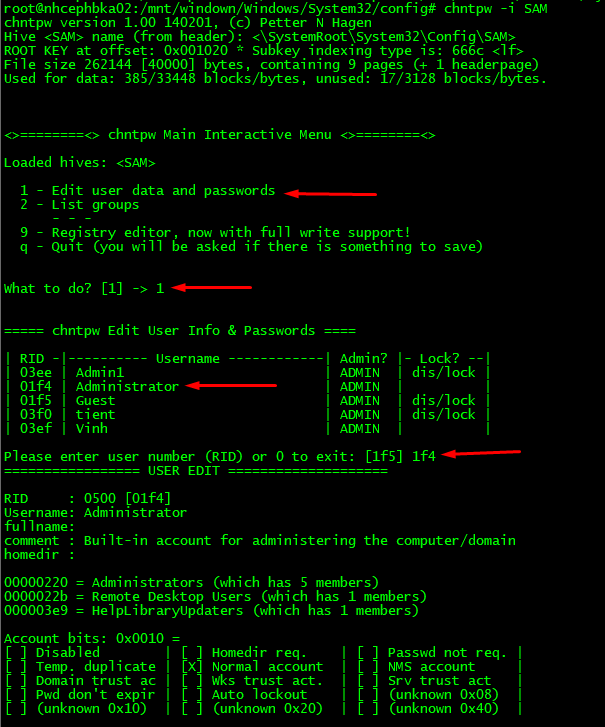
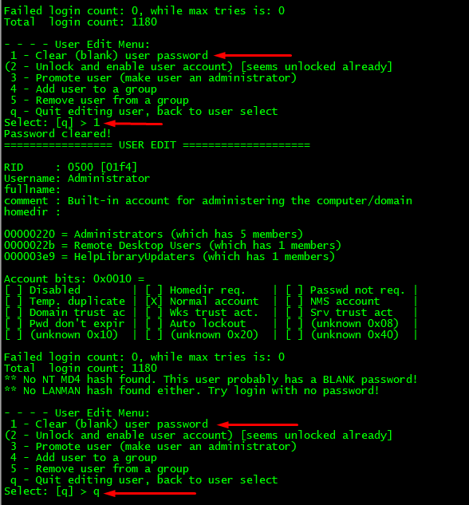
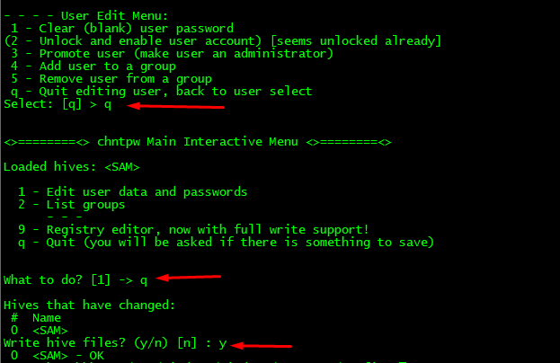

## Hướng dẫn reset pass Windown trong KVM

Truy cập vào host KVM và cài đặt các package cần thiết

```sh
yum install chntpw -y
yum install kpartx -y
```

Kiểm tra các logical loopback device

```sh
losetup -f
```

Tiến hành Shutoff VPS Windown cần reset pass

```sh
virsh shutdown kvm863
```

Kiểm tra đường dẫn chứa file image của VM

```sh
virsh dumpxml kvm863 | grep 'source file'
```

Tiếp theo chúng ta mount image của windown cần reset password như loopback device

```sh
losetup /dev/loop0 /backup_SolusVM/solusvm_backup/kvm863_backup
```

Thêm partition mappings

```sh
kpartx -av /dev/loop0
```

Tạo một thư mục sử dụng để mount

```sh
mkdir -p /mnt/window
```

Tiến hành mount filesystem của VPS tới thư mục vừa tạo

```sh
mount /dev/mapper/loop0p2 /mnt/window
```

Truy cập tới đường dẫn chứa file SAM của VPS

```sh
cd /mnt/window/Windows/System32/config/
```

Tiến hành reset password
```sh
chntpw -i SAM
```







Sau khi reset pass về Blank chúng ta bỏ mount các thư mục

```sh
umount /mnt/window
```

Xóa partition mappings

```sh
kpartx -dv /dev/loop0
```

Bỏ mount loopback device

```sh
losetup -d /dev/loop0
```


