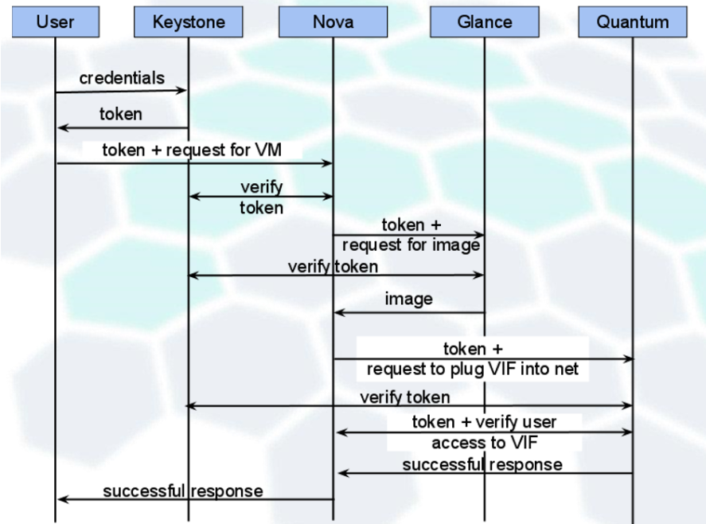
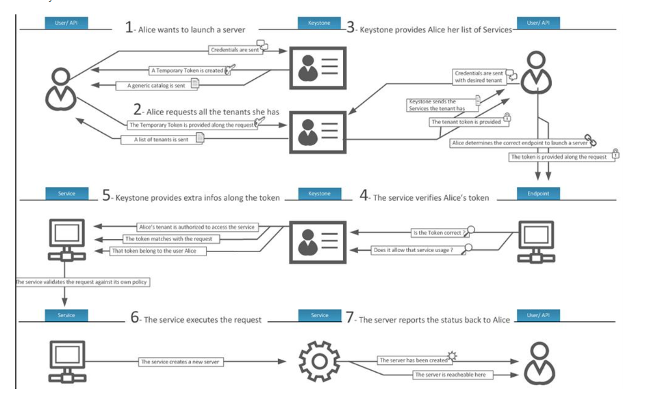

## Muc Luc
### [1. Khái niệm KeyStone](#keystone) 
### 2. Các thành phần trong KeyStone
### 3. Các định dạng của Tokens
### 4. KeyStone Workflow
### 5. KeyStone User Management
### 6. KeyStone Service Management

============================================================================

### 1. Khái niệm KeyStone
Keystone là OpenStack project cung cấp các dịch vụ Identity, Token, Catalog, Policy cho các project khác trong OpenStack. Nó triển khai Identity API của OpenStack
Hai tính năng chính của Keystone:
- User Management: keystone xác thực tài khoản người dùng và chỉ định xem người dùng có quyền được làm gì
- Service Catalog: Cung cấp một danh mục các dịch vụ sẵn sàng cùng với các API endpoints để truy cập các dịch vụ đó

### 2. Các khái niệm trong KeyStone
Keystone cung cấp các dịch vụ chính như sau:
- Project:
  - Khái niệm chỉ sự gom gộp, cô lập các nguồn tài nguyên
  - Các project tự mình không có các user, các user và group muốn truy cập tài nguyên trong project phải được gán role để quy định tài nguyên được phép truy cập trong project (khái niệm role assignment)
- Domain: 
  - Domain là tập hợp bao gồm các user, group, project
  - Tránh gây ra xung đột không mong muốn về user name giữa các tổ chức khác nhau trong cùng một hệ thống cloud
  - Phân chia tài nguyên vào các "kho chứa" để sử dụng độc lập với mỗi tổ chức
- Users và User Groups:
  - User: thực thể được phép truy cập vào tài nguyên cloud đã đươck cô lập bởi domain và project
  - Group: tập hợp các user
- Roles:
  - Khái niệm gắn liên với Authorization (ủy quyền), giới hạn các thao tác vận hành hệ thống và nguồn tài nguyên mà user được phép. Role được gán cho user và nó được gán cho user đó trên một project cụ thể. ("assigned to" user, "assigned on" project)
- Identity: các Identity service cung cấp dịch vụ xác thực các thông tin chứng thực người dùng gửi tới, cung cấp dữ liệu về Users, Projects, Roles cũng như các metadata khác
- Token: Có thể coi là chìa khóa để truy cập tài nguyên trên cloud. Token được sử dụng để xác thực tài khoản người dùng và ủy quyền cho người dùng khi truy cập tài nguyên.Token bao gồm:
  - ID: định danh duy nhất của token trên cloud
  - payload: là dữ liệu về người dùng (user được truy cập trên project nào, danh mục các dịch vụ sẵn sàng để truy cập cùng với endpoints truy cập các dịch vụ đó), thời gian khởi tạo, thời gian hết hạn, etc.  
- Catalog: cung cấp endpoints (địa chỉ) của các dịch vụ sử dụng cho việc tìm kiếm và truy cập các dịch vụ
- Assignment:
  - Thể hiện sự kết nối giữa một actor(user và user group) với một actor(domain, project) và một role
  - Role assignment được cấp phát và thu hồi, và có thể được kế thừa giữa các user và group trên project của domains

Mỗi dịch vụ lại được cấu hình để sử dụng một backend cho phép keystone lưu trữ thông tin Identity như thông tin credentials, token, etc. Việc quy định mỗi dịch vụ sử dụng hệ thống backend nào được cấu hình trong file keystone.conf. Một số hệ thống backend điển hình:
- KVS Backend(hiện tại không còn sử dụng): là giao diện backend đơn giản hỗ trợ tìm kiếm theo khóa chính
- SQL Backend: cung cấp hệ thống backend bền vững để lưu trữ thông tin
- PAM Backend: Hệ thống backend mở rộng cung cấp quan hệ 1-1 giữa user và tenants(sử dụng trong các phiên bản cũ như Gzilly ).
- LDAP Backend: LDAP là hệ thống lưu trữ các user và project trong các subtree tách biệt nhau.
- Multiple Backend: sử dụng kết hợp nhiều hệ thống Backend, trong đó SQL lưu trữ các service account (tài khoản của các dịch vụ như: nova glance, etc.), còn LDAP sử dụng lưu trữ thông tin người dùng, etc.

### 3. Các định dạng của Tokens
- Token có các định dạng sau
  - UUID
  - PKI
  - PKIZ
  - Fernet

### 4. KeyStone Workflow
- Sơ đồ tương tác đơn giản giữa người dùng và các service trong openstack

### 5. KeyStone User Management
Keystone quản lý các user, project(tenants), roles, chịu trách nhiệm xác thực và ấn định quyền truy cập các tài nguyên trong hệ thống. Có ba khái niệm chính trong tính năng User Management:
- User: là tải khoản của người sử dụng dịch vụ, bao gồm một số thông tin như: username, password, email
- Project(tenant): khái niệm liên quan tới việc gộp, cô lập các nguồn tài nguyên. Tự các project không hề có user. Người dùng được gán roles đối với mỗi project, quy định quyền truy cập tài nguyên trong project.
- Roles: chỉ định các thao tác vận hành hệ thống được phép thực hiện, tài nguyên mà người dùng được phép sử dụng.

### 6. KeyStone Service Management
Keystone cũng cung cấp danh mục các dịch vụ cùng với các API endpoints để truy cập các dịch vụ đó. Có hai khái niệm chính trong tính năng "service management":
- Services: các dịch vụ khác trong OpenStack sẽ có tài khoản tương ứng (thường có có tên tài khoản trùng code name của dịch vụ như nova, glance, etc.). Các tài khoản này thuộc domain đặc biệt tên là service.
- Endpoints: điểm đầu mối để truy cập các dịch vụ, thể hiện bằng URL để truy cập các dịch vụ đó.

