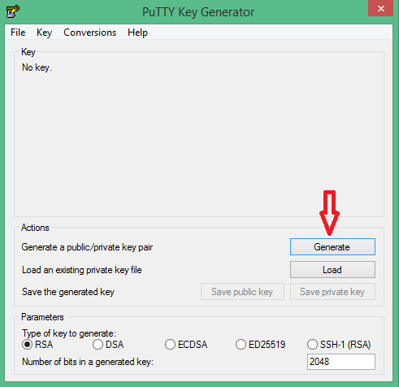
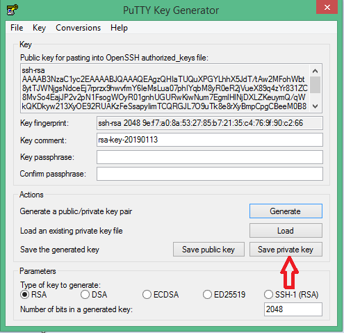
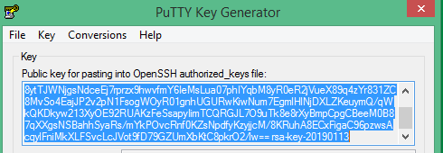

## Tìm hiểu về SSH Key

## Mục Lục

### 1. SSH Key là gì?
- SSH Keys là một phương thức xác thực đăng nhập với máy chủ thông qua truy cập SSH bằng việc đối chiếu giữa một cặp keys, bao gồm một khóa riêng tư (private key) và khóa công khai (public key) tương ứng. SSH Keys sử dụng giao thức xác thực hỏi và trả lời trong đó một bên trình bày một câu hỏi và một bên khác phải cung cấp một câu trả lời hợp lệ để được chứng thực.

- Thông thường, một người dùng đăng nhập VPS thông qua username root và password của user đó. Người dùng có thể mất quyền truy cập VPS nếu bị quên hoặc để lộ mật khẩu hay bị dò tìm mật khẩu qua Brute Force Attack. Do đó, việc sử dụng SSH Keys sẽ bảo mật hơn rất nhiều so với phương pháp đăng nhập dùng mật khẩu truyền thống.

- Một cách đơn giản ta có thể so sánh Private Key như là chìa khóa còn Public Key là ổ khóa

### 2. Các thành phần của SSH Key
- Khi tạo ra một SSH Key, bạn cần biết sẽ có 3 thành phần
  - Public Key : Bạn sẽ copy ký tự key này sẽ bỏ vào file ~/.ssh/authorized_keys trên server của bạn.
  - Private Key : Bạn sẽ lưu file này vào máy tính, sau đó sẽ thiết lập phiên ssh sử dụng key này để có thể login.
  - Keypharse : Mật khẩu để mở private key, khi đăng nhập vào server nó sẽ hỏi cái này (Nếu không đặt pass cho private key thì có thể bỏ qua)

### 3. Nguyên tắc hoạt động của ssh key

- Private key và Public key luôn có liên hệ chặt chẽ với nhau để nó có thể nhận diện lẫn nhau. Khi tạo một SSH Key thì người dùng sẽ có cả 2 loại key này. Sau đó người dùng mang public key upload lên máy chủ của mình, còn cái private key của người dùng sẽ lưu ở máy và khi đăng nhập vào server, người dùng sẽ gửi yêu cầu đăng nhập kèm theo cái Private Key này để gửi tín hiệu đến server, server sẽ kiểm tra xem cái Private key của người dùng có khớp với Public key có trên server hay không, nếu có thì bạn sẽ đăng nhập được.

### 4. Cách tạo SSH Key

- Đối với windows
  - Người dùng có thể sử dụng phần mềm PuTTY-Gen để tạo SSH key.Sau khi download phần mềm PuTTY-Gen về và cài đặt ta làm theo hướng dẫn như hình bên dưới
  
  
  - Sau khi click vaof genarate bạn di chuyển chuột quanh màn hình để tạo key.Sau khi tạo key xong ta click vào Save private key như hình bên dưới để lưu lại private key được tạo ra
  
  
  - Sau đó ta lưu lại đoạn private key ra một file với nội dung copy đoạn mã như ảnh bên dưới
  
  
  
- Đối với Linux
  - Trên server Linux chạy lệnh ssh-keygen -t rsa
  - Sau khi bạn chạy lệnh trên màn hình sẽ hiện ra thông báo hiển thị đường dẫn lưu key được tạo ra, mặc định key public và private sẽ được lưu trong đường dẫn /root/.ssh/ (Trong bước này bạn có thể đặt pass cho private key nếu cần)
  
  ```sh
  [root@vm1 ~]# ssh-keygen -t rsa
  Generating public/private rsa key pair.
  Enter file in which to save the key (/root/.ssh/id_rsa): 
  Enter passphrase (empty for no passphrase): 
  Enter same passphrase again: 
  Your identification has been saved in /root/.ssh/id_rsa.
  Your public key has been saved in /root/.ssh/id_rsa.pub.
  The key fingerprint is:
  SHA256:7yhHgSH3v8oSFurEJph1prGk1YekXKb2esS8rp4AY6k root@vm1.novalocal
  The key's randomart image is:
  +---[RSA 2048]----+
  |                 |
  |    = o          |
  | . B + +         |
  |  @ = + o        |
  |o@ @ o .So       |
  |B.+ X o ...      |
  |E  B o o  ..     |
  | ...+ o..o.      |
  | .++.  ++..      |
  +----[SHA256]-----+
  ```
  
  


  

  
